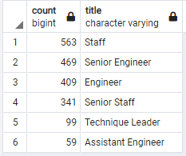
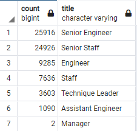
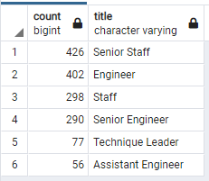

# Pewlett-Hackard_Analysis

## Overview of the analysis
The aim of the analysis is to determine the number of retiring employees per title and identify those who are eligible to participate in a mentorship program, in order to handle the siver tsunami as many employees reach retirement age.

## Results
###D1
* The first table(retirement_titles) includes all employees who are in retirement age even those who have already left the company.
* The second table represents employees with the most recent job title and in retirement age.
* The third table shows the number of employees by title, which can help determine the number of mentors in the mentorship program.
* The 2 positions who has the lowest number of employees are Manager and Assistant Engineer. On the other hand, the 2 highest are Senior Engineer and Senior Staff.   
###D2
* Filtered by birth dates between January 1, 1965 and December 31, 1965.
* Filtered by to_date('9999-01-01) to eliminate employees who already left the company.
* Ordering the table by the employee number.
* Exported the Mentor Eligibility table to csv.
## Summary
There are 2 roles( Sernior Engineer and Senior Staff) that needs to be filled according to the silver tsunami.
There are enough qualified employees in the departments to mentor the next generation of Pewlett Hackard generation.

